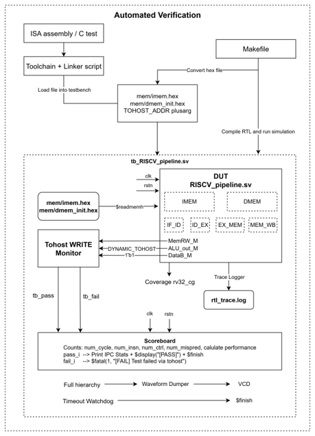
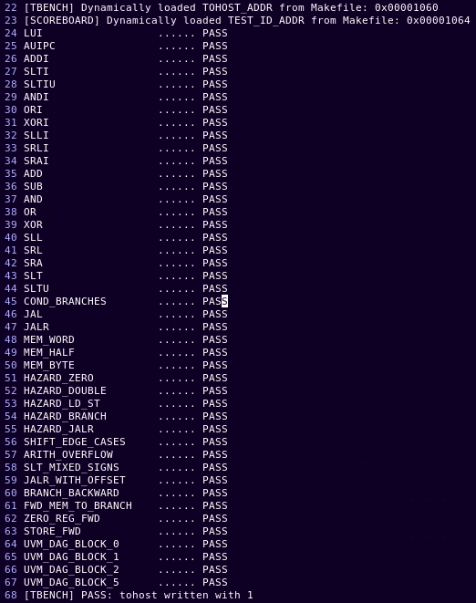
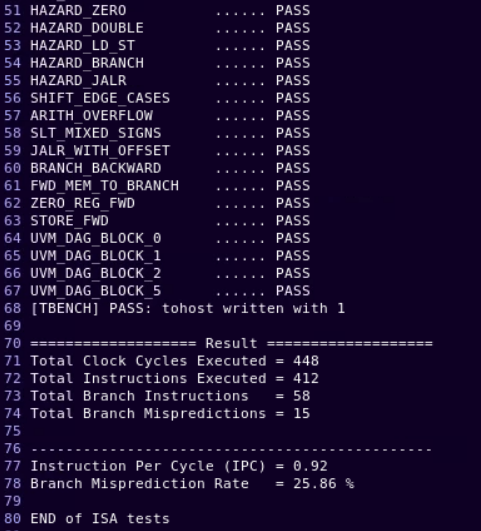
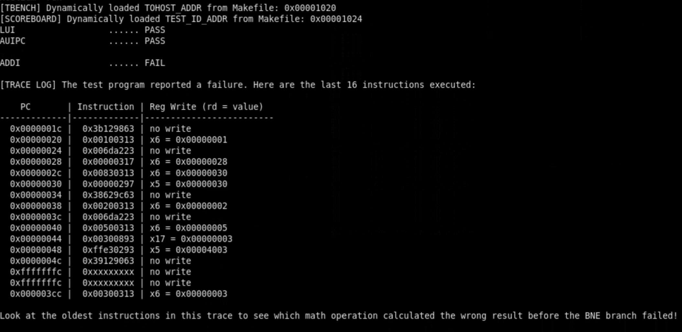

# 🔬 Automated Verification — VN Chip Talent Program | Group 4 · Project 7

> An automated RTL verification framework for a RISC-V pipelined processor, built as part of the **VN Chip Talent Program**. The system compiles ISA test programs, runs RTL simulation, and automatically checks correctness via a self-checking testbench — with full scoreboard reporting, performance counters, and trace-based debug logging.

---

## 📑 Table of Contents

- [Overview](#overview)
- [System Architecture](#system-architecture)
- [Key Features](#key-features)
- [Test Coverage](#test-coverage)
- [Simulation Flow](#simulation-flow)
- [Testbench Components](#testbench-components)
- [Sample Results](#sample-results)
- [Project Documents](#project-documents)
- [Team](#team)

---

## Overview

This project delivers a **fully automated verification environment** for a 5-stage RISC-V RV32I pipeline processor (`RISCV_pipeline.sv`). Rather than relying on manual waveform inspection, the framework:

1. **Compiles** ISA assembly/C test programs using the RISC-V toolchain and linker script.
2. **Converts** the binary into `.hex` memory files (`imem.hex`, `dmem_init.hex`).
3. **Runs RTL simulation** automatically via Makefile, loading the hex files into the testbench.
4. **Self-checks** results through a *Tohost WRITE Monitor* and a *Scoreboard*, printing PASS/FAIL per test case.
5. **Reports performance metrics** (IPC, branch misprediction rate) and generates a VCD waveform dump.
6. **Logs execution traces** (`rtl_trace.log`) for debugging failed tests, showing the last 16 instructions before failure.

---

## System Architecture

The diagram below illustrates the complete verification flow — from source test to final result:



### Flow Summary

```
ISA Assembly / C Test
        │
        ▼
Toolchain + Linker Script  ──(Makefile)──►  Compile RTL & Run Simulation
        │                                              │
        ▼                                              ▼
  mem/imem.hex                              tb_RISCV_pipeline.sv
  mem/dmem_init.hex                         │
  TOHOST_ADDR plusarg                       ├── DUT: RISCV_pipeline.sv
        │                                   │    ├── IF_ID  ID_EX  EX_MEM  MEM_WB
        └──── $readmemh ──────────────────► │    ├── IMEM / DMEM
                                            │
                                            ├── Tohost WRITE Monitor  →  tb_pass / tb_fail
                                            ├── Scoreboard            →  PASS/FAIL + IPC report
                                            ├── Coverage: rv32_cg
                                            ├── Trace Logger          →  rtl_trace.log
                                            ├── Waveform Dumper       →  VCD
                                            └── Timeout Watchdog      →  $finish
```

---

## Key Features

| Feature | Description |
|---|---|
| 🤖 **Fully Automated** | Single `make` command compiles, simulates, and verifies — no manual interaction |
| 📋 **Self-Checking Testbench** | Tohost monitor detects pass/fail signalling from the running test program |
| 📊 **Performance Scoreboard** | Counts cycles, instructions, branches, mispredictions; reports IPC & misprediction rate |
| 🔍 **Trace Logger** | On failure, prints the last 16 executed instructions with PC, opcode, and register write values |
| 📈 **Functional Coverage** | SystemVerilog covergroup `rv32_cg` tracks instruction-level coverage |
| 🌊 **Waveform Dump** | Full hierarchy VCD generation for deep-dive debugging in GTKWave or similar |
| ⏱️ **Timeout Watchdog** | Automatically terminates hung simulations to prevent infinite loops |
| ⚡ **Dynamic Plusargs** | `TOHOST_ADDR` and `TEST_ID_ADDR` loaded at runtime from Makefile — no testbench recompilation needed |

---

## Test Coverage

The test suite covers the full **RV32I base integer ISA**, including hazard handling and pipeline edge cases:

### Base ISA Instructions

| Category | Tests |
|---|---|
| **U-Type** | `LUI`, `AUIPC` |
| **Arithmetic (I-Type)** | `ADDI`, `SLTI`, `SLTIU`, `ANDI`, `ORI`, `XORI`, `SLLI`, `SRLI`, `SRAI` |
| **Arithmetic (R-Type)** | `ADD`, `SUB`, `AND`, `OR`, `XOR`, `SLL`, `SRL`, `SRA`, `SLT`, `SLTU` |
| **Control Flow** | `COND_BRANCHES`, `JAL`, `JALR` |
| **Memory** | `MEM_WORD`, `MEM_HALF`, `MEM_BYTE` |

### Hazard & Edge Case Tests

| Test | Description |
|---|---|
| `HAZARD_ZERO` | Read-after-write hazard involving x0 register |
| `HAZARD_DOUBLE` | Back-to-back data hazards requiring multiple forwards |
| `HAZARD_LD_ST` | Load-store hazard sequences |
| `HAZARD_BRANCH` | Control hazards involving branch instructions |
| `HAZARD_JALR` | Jump-and-link-register hazard scenarios |
| `SHIFT_EDGE_CASES` | Shift amount boundary conditions |
| `ARITH_OVERFLOW` | Signed/unsigned arithmetic overflow behavior |
| `SLT_MIXED_SIGNS` | Set-less-than with mixed sign operands |
| `JALR_WITH_OFFSET` | JALR with non-zero base offsets |
| `BRANCH_BACKWARD` | Backward (loop) branch prediction |
| `FWD_MEM_TO_BRANCH` | Memory-to-branch forwarding path |
| `ZERO_REG_FWD` | Forwarding involving x0 (hardwired zero) |
| `STORE_FWD` | Store-to-load forwarding sequences |

### UVM DAG Directed Tests

| Test |
|---|
| `UVM_DAG_BLOCK_0` |
| `UVM_DAG_BLOCK_1` |
| `UVM_DAG_BLOCK_2` |
| `UVM_DAG_BLOCK_5` |

---

## Simulation Flow

### Prerequisites

- RISC-V GCC Toolchain (`riscv32-unknown-elf-gcc`)
- SystemVerilog simulator (e.g., **VCS**, **Questa**, **Icarus Verilog**)
- GNU Make

### Running the Verification Suite

```bash
# Run all ISA tests
make all

# Run a specific test
make TEST=HAZARD_BRANCH

# Clean build artifacts
make clean
```

The Makefile automatically:
1. Assembles/compiles the test program
2. Links with the memory map script
3. Converts ELF to `.hex` files
4. Invokes the simulator with correct plusargs
5. Reports PASS/FAIL to stdout

---

## Testbench Components

### `tb_RISCV_pipeline.sv` — Top-Level Testbench

The testbench wraps the DUT and instantiates all verification infrastructure:

- **Clock & Reset generation** — drives `clk` and `rstn` to the pipeline
- **Memory Initialization** — uses `$readmemh` to load `imem.hex` and `dmem_init.hex`
- **Plusarg Loader** — dynamically reads `TOHOST_ADDR` and `TEST_ID_ADDR` at simulation start
- **Waveform Dumper** — full hierarchy VCD dump enabled at start

### Tohost WRITE Monitor

Watches the data memory bus for writes to the `TOHOST_ADDR` address:
- Write value `1` → **`tb_pass`** signal asserted → test passes
- Any other value → **`tb_fail`** signal asserted → test fails

### Scoreboard

Triggered by `tb_pass` or `tb_fail`, the scoreboard:
- Prints per-test **PASS / FAIL** status
- Accumulates and prints final performance counters:
  - Total clock cycles
  - Total instructions executed
  - Total branch instructions
  - Total branch mispredictions
  - **IPC** (Instructions Per Cycle)
  - **Branch Misprediction Rate (%)**

### Trace Logger

On failure, the trace logger prints the **last 16 instructions** executed before the failure signal, including:
- Program Counter (PC)
- Raw instruction encoding
- Register write destination and value

This gives developers immediate visibility into what went wrong without needing to open waveforms.

### Coverage Collector (`rv32_cg`)

A SystemVerilog covergroup tracking RV32I instruction coverage to ensure all opcodes and edge cases are exercised during the regression run.

---

## Sample Results

### ✅ Passing Run — All Tests Pass





**Sample metrics from a passing run:**
```
Total Clock Cycles Executed  = 448
Total Instructions Executed  = 412
Total Branch Instructions    = 58
Total Branch Mispredictions  = 15

Instruction Per Cycle (IPC)      = 0.92
Branch Misprediction Rate        = 25.86 %
```

### ❌ Failing Run — Trace Debug Output

When a test fails, the Trace Logger dumps the last 16 instructions to pinpoint the bug:



The trace format:
```
PC         | Instruction | Reg Write (rd = value)
-----------|-------------|------------------------
0x00000020 | 0x00100313  | x6 = 0x00000001
0x00000024 | 0x006da223  | no write
...
```

> Look at the oldest instructions in the trace to find which math operation produced the wrong result before a branch failed.

---

## Project Documents

| Document | Description |
|---|---|
| 📄 [Automated Verification Proposal](Group%204%20-%20Project%207%20-%20Automated%20Verification%20Proposal.docx) | Initial project proposal and scope |
| 📄 [Full Project Specification](Group%204%20-%20Project%207%20-%20Automated_Verification_Full_Spec.docx) | Detailed technical specification |
| 📄 [One-Page Final Spec](Group%204%20-%20Project%207%20-%20One-page%20Final%20Project%20Spec.docx) | Condensed summary specification |
| 📄 [Assessment Rubric](Topic_7_Automated_Verification_Assessment.docx) | Project assessment criteria |
| 📊 [Presentation Slides](%5BNhóm%204%5D%20-%20Automated%20Verification%20-%20Slide.pptx) | Final group presentation |

---

## Team

**Group 4 — VN Chip Talent Program | Project 7: Automated Verification**

> 🇻🇳 *VN Chip Talent Program* — Empowering the next generation of Vietnamese chip design engineers.

---

<div align="center">

**RISC-V · SystemVerilog · RTL Verification · Automated Testing · Pipeline Architecture**

</div>
